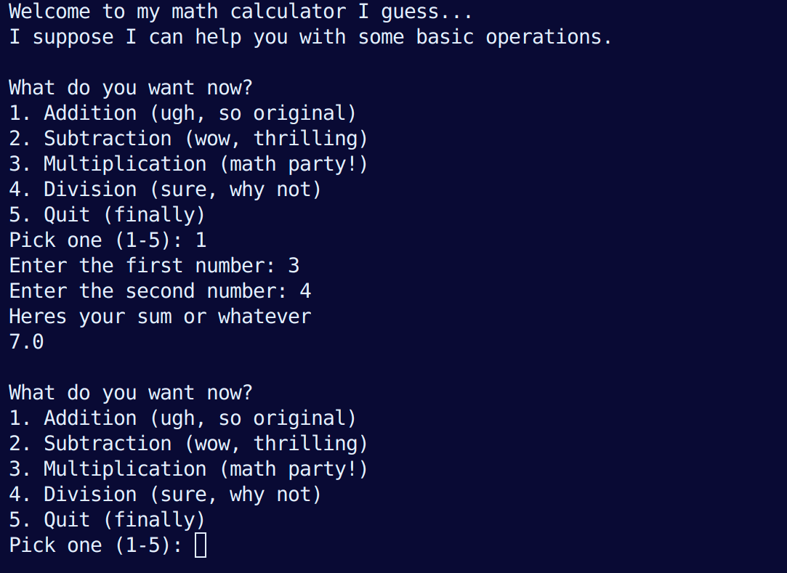

# 🧮 Sarcastic Math Calculator

Welcome to the **most unenthusiastic calculator ever written in Python**.  
This calculator can add, subtract, multiply, and divide numbers… but don’t expect it to be *excited* about it.

---

## 📖 Features

- **Addition** → “Heres your sum or whatever.”
- **Subtraction** → “Yeah subtraction is boring heres your answer.”
- **Multiplication** → “Do you really need to multiply? Fine, heres your product.”
- **Division** → Includes sarcastic remarks about dividing by zero.
- **Quit option** → Because even the calculator needs a nap.

---

## ⚙️ How to Run

1. Make sure you have Python installed (3.x recommended).
2. Save the code into a file, for example:

   ```bash
   math_calculator.py
3. Run it from your terminal
    ```bash
    python math_calculator.py

## 📋 Usage

When you run the program, it will greet you (begrudgingly) and give you a menu:
1. Addition (ugh, so original)
2. Subtraction (wow, thrilling)
3. Multiplication (math party!)
4. Division (sure, why not)
5. Quit (finally)

* Choose an option by typing the number.
* Enter two numbers when asked.
* If you try dividing by zero, the calculator will roast you.
* If you type nonsense, it’ll complain.

## 🌳 Program Flow

Here’s a decision tree that shows how the calculator works:



# 🤷 Why?

Because boring calculators are everywhere.
This one is sarcastic. That’s it.
